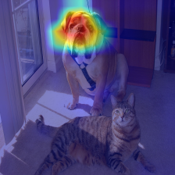
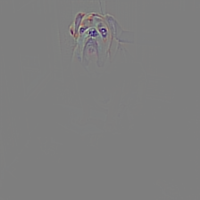
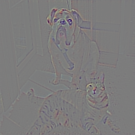

# chainer-grad-cam

chainerでGrad-CAMを実装
最終の特徴マップの出力に対する勾配を計算することで注視領域を計算している。

## 結果

||Grad-CAM|Guided Backpropagation|Guided Grad-CAM|
|:-:|:-:|:-:|:-:|
|Boxer (242)||||
|Tiger Cat (282)||||

## 必要ライブラリ

- Chainer
- Cupy (for GPU support)
- OpenCV

## オプションの設定方法
```
python run.py --input images/dog_cat.png --label 242 --layer conv5_3 --gpu 0
python run.py --input images/dog_cat.png --label 282 --layer conv5_3 --gpu 0
```

## 元論文

- [1] Ramprasaath R. Selvaraju, Abhishek Das, Ramakrishna Vedantam, Michael Cogswell, Devi Parikh, Dhruv Batra,
"Grad-CAM: Visual Explanations from Deep Networks via Gradient-based Localization",
https://arxiv.org/abs/1610.02391
